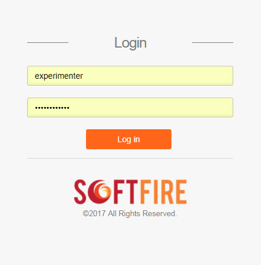
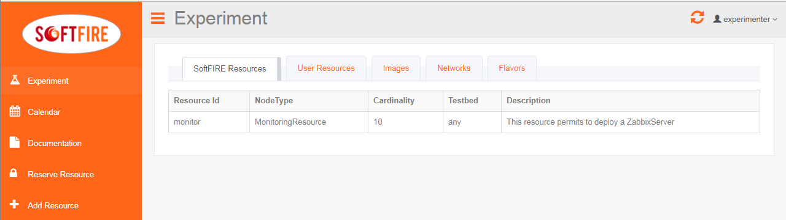
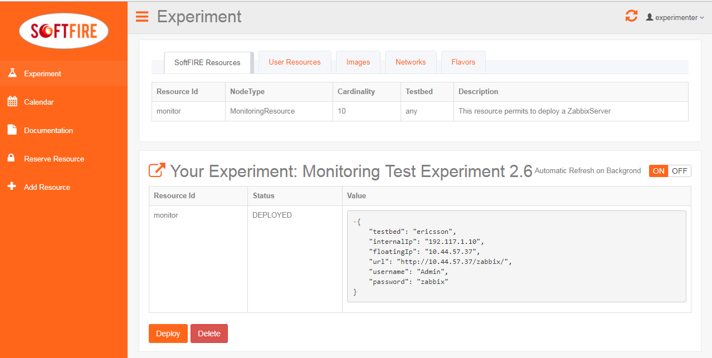
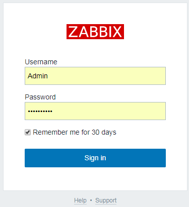
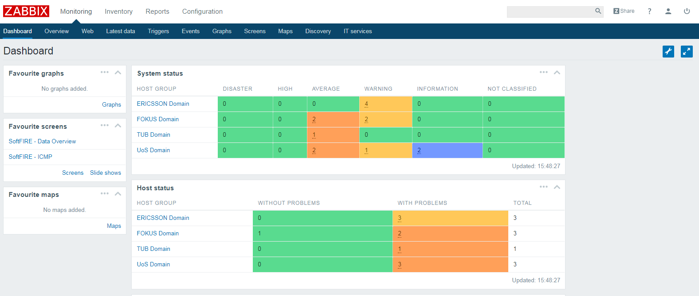

# Monitoring Tutorial -- Preliminary Version

This tutorial will guide you through the definition of Monitoring example and to upload it.

!!! Note
    This tutorial assumes that you use a Unix system.

Create all the folders needded

```
$ mkdir monitoring-softfire
$ cd monitoring-softfire
$ mkdir TOSCA-Metadata
$ mkdir Definitions
```

now we need to create the necessary files.

```
touch TOSCA-Metadata/TOSCA.meta
touch TOSCA-Metadata/Metadata.yaml
touch Definitions/experiment.yaml
```

The TOSCA-Metadata/TOSCA.meta file contains TOSCA specific configurations:

```
vim TOSCA-Metadata/TOSCA.meta
```

Here you must write something like the following example:

```
TOSCA-Meta-File-Version: 1.0
CSAR-Version: 1.1
Created-By: SoftFIRE
Entry-Definitions: Definitions/experiment.yaml
```

If you wish, you can change the Created-By property.

then we do the same with TOSCA-Metadata/Metadata.yaml that contains Metadata info of the experiment

```
vim TOSCA-Metadata/Metadata.yaml
```

Here you should write something like the following example:

```yaml
name: Experiment Name
start-date: "2017-08-10"
end-date: "2017-08-11"
```

Change start-date and end-date fields according to your experiment.
now we can write the definition of the experiment:

```sh
vim Definitions/experiment.yaml
```

Here you should write something like the following example:

```yaml
description: "Template for SoftFIRE yaml resource request definition"
imports:
  - softfire_node_types: "http://docs.softfire.eu/etc/softfire_node_types.yaml"
topology_template:
  node_templates:
    m:
      type: MonitoringResource
      properties:
        testbed: ericsson
        lan_name: Zabbix_Lan
        resource_id: monitor

```

all the fields are explained in the [Monitoring manager page](monitoring-manager.md)

Create the CSAR file:

```sh
zip -r monitoring.csar . -x ".*" -x "*/.*"
```

Now you have to uploaded this file to the Experiment Manager GUI like the following images.
Go to [experimenter page](http://experiment.vpn.softfire.eu:5080/experimenter) and login with your registered credentials, then click on "Reserve Resource"






Now you can select the zip file to upload and then click on Start Upload


The Managers will validate the resources, in case you did some mistake they should be shown now. If no errors are shown, you are able to deploy your resources by clicking deploy. Please consider that it takes some seconds to deploy the resource dependening in the experiment definition.



Once deployed, it will take time until reaching the ACTIVE state of the resource. A button on the right enable the automatic refresh of the resources' values or disable it, in the second case you will need to refresh the page. Finally the monitoring resource reaches the ACTIVE state and also the floating ip are shown in the newly created resource section of the experimenter GUI. Note that the floating ip changes for every deployment.

Now you can access your Zabbix Server opening the URL shown in the picture above



You can access the Zabbix Server using the following credentials:
Username: Admin
Password: zabbix



On succesfull login the Zabbix Dashboard is displayed.

<!---
 Script for open external links in a new tab
-->
<script src="http://ajax.googleapis.com/ajax/libs/jquery/1.7.1/jquery.js"></script>
<script type="text/javascript" charset="utf-8">
      // Creating custom :external selector
      $.expr[':'].external = function(obj){
          return !obj.href.match(/^mailto\:/)
                  && (obj.hostname != location.hostname);
      };
      $(function(){
        $('a:external').addClass('external');
        $(".external").attr('target','_blank');
      })
</script>
