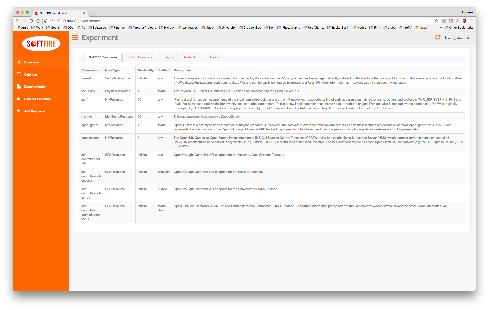
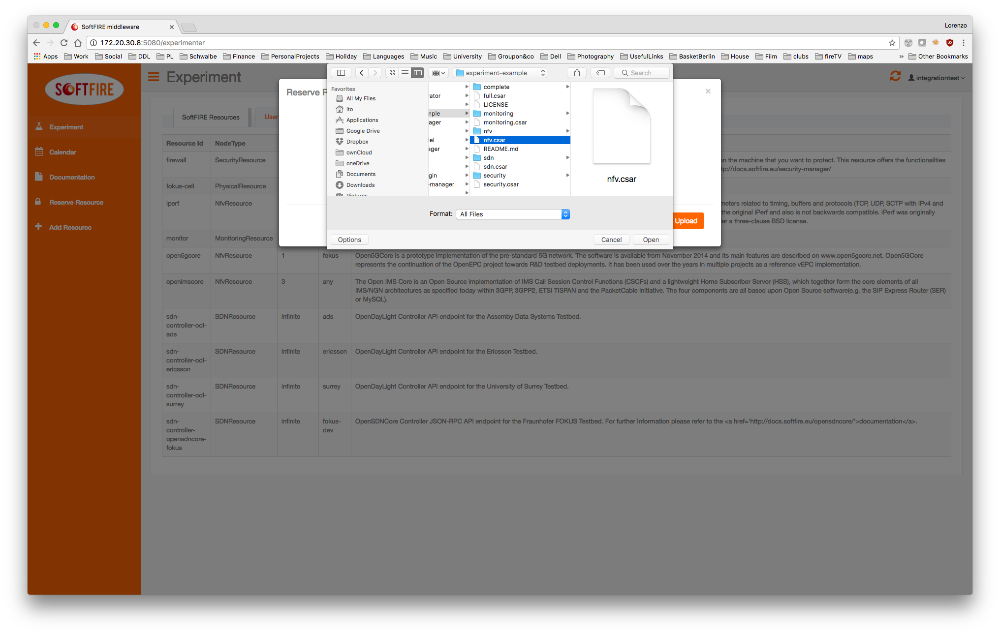

# Nfv tutorial Iperf

This tutorial will guide you through the definition of the iperf example and to upload it.

!!! Note
    This tutorial assumes that you use a Unix system.

First of all create a folder where we can put all the necessary files.

```sh
mkdir iperf-softfire
cd iperf-softfire
```

then we start creating the inner folders

```sh
mkdir Files
mkdir TOSCA-Metadata
mkdir Definitions
```

now we need to create the necessary files.

```sh
touch TOSCA-Metadata/TOSCA.meta
touch TOSCA-Metadata/Metadata.yaml
touch Definitions/experiment.yaml
```

The _TOSCA-Metadata/TOSCA.meta_ file contains TOSCA specific configurations:

```sh
vim TOSCA-Metadata/TOSCA.meta
```

Here you must write something like this:

```sh
TOSCA-Meta-File-Version: 1.0
CSAR-Version: 1.1
Created-By: SoftFIRE
Entry-Definitions: Definitions/experiment.yaml
```

You can change the _Created-By_ property, if you wish.

then we do the same with _TOSCA-Metadata/Metadata.yaml_ that contains Metadata info of the experiment

```sh
vim TOSCA-Metadata/Metadata.yaml
```

Here you should write something like this:

```sh
name: ExperimentIperf
start-date: "2017-7-2"
end-date: "2017-7-15"
```

Finally we can move the real definition of the experiment:

```sh
vim Definitions/experiment.yaml
```

Here you should write something like this:

```yaml
---
description: "Template for SoftFIRE yaml resource request definition"
imports:
  - softfire_node_types: "http://docs.softfire.eu/etc/softfire_node_types.yaml"
topology_template:
  node_templates:
    iperf:
      properties:
        resource_id: iperf
        testbeds:
          ANY: fokus
        ssh_pub_key: "ssh-rsa AAAAB3NzaC1yc2EAAAADAQABAAABAQDNyPHgao8TpwOuEYo497w7kKOztMiRQ9m59ZBZr7Xnb6LWcIhjuqrxlFmNlluw7V1+hot6RA6psh2xPC/+urTfevIY6p8pOZmPtMToZmP2/5BPVkBAHAUISU/BZxDAM75QX14CHg/4imcfLxzLyx4XY0SjwfrxtqTTJJW2khKJ5eNoMHnw9+NwNiM1BY9A1khZ2WXZMAlG8+NkZU+UZhIiyHWYZQU8ZrC02qI/zFfaGFX7OC/yDGbZOeGV/cuissvai4vn8gtS1Stdj+QJZ/Mcl3t2A65FlW8oSYzih+OrxLsvJ2w8dxBBdw39lPcihb3e8Za29aiKMrUINleVJ82P"
        nsd_name: "iperf"
      type: NfvResource
tosca_definitions_version: tosca_simple_yaml_1_0
```

where all the fields are explained in the [Nfv Manager page](nfv-manager.md). Important to be noticed is that we are using the resource id: _*iperf*_. Another important field is the _*ssh_pub_key*_. Here you should put your public key, in order to be able to access the deployed VMs via ssh.

## Putting all together

Now is time to create the CSAR file:

```sh
zip -r iperf.csar . -x ".*" -x "*/.*"
```

this command will create the CSAR file that must be uploaded to the Experiment Manager GUI like the following images.






When you click on send, the Managers will validate the resources, in case you did some mistake they should be shown now. If no errors are shown, you are able to deploy your resources by clicking deploy. Please consider that it takes some seconds to deploy the resource dependening in the experiment definition.


Once deployed, it will take time until reaching the ACTIVE state of the resource. A button on the right enable the automatic refresh of the resources' values or disable it, in the second case you will need to refresh the page.


Finally the Iperf resource reaches the ACTIVE state and also the floating ip are shown. You are now able to ssh into the server or client and see the running screen.

```sh
~|⇒ ssh -i /opt/softfire/key/softfire-key.pem ubuntu@172.20.30.91
Warning: Permanently added '172.20.30.91' (ECDSA) to the list of known hosts.
Welcome to Ubuntu 16.04.2 LTS (GNU/Linux 4.4.0-77-generic x86_64)

 * Documentation:  https://help.ubuntu.com
 * Management:     https://landscape.canonical.com
 * Support:        https://ubuntu.com/advantage

  Get cloud support with Ubuntu Advantage Cloud Guest:
    http://www.ubuntu.com/business/services/cloud

87 packages can be updated.
45 updates are security updates.


Last login: Thu Jul 20 14:41:18 2017 from 172.20.10.131
ubuntu@server-9771458:~$
ubuntu@server-9771458:~$
ubuntu@server-9771458:~$
```

!!! Note
    The floating ip changes for every deployment

and see the running screen:

```sh
ubuntu@server-9771458:~$ sudo screen -x

------------------------------------------------------------
Server listening on TCP port 5001
TCP window size: 85.3 KByte (default)
------------------------------------------------------------
[  4] local 192.168.23.12 port 5001 connected with 172.20.30.100 port 47270
[ ID] Interval       Transfer     Bandwidth
[  4]  0.0-300.0 sec  30.4 GBytes   872 Mbits/sec
```

Then remember always to delete the resources by clicking in the delete button.

!!! Note
    Also this request can last some seconds, so don't be impatient! :stuck_out_tongue_winking_eye:
