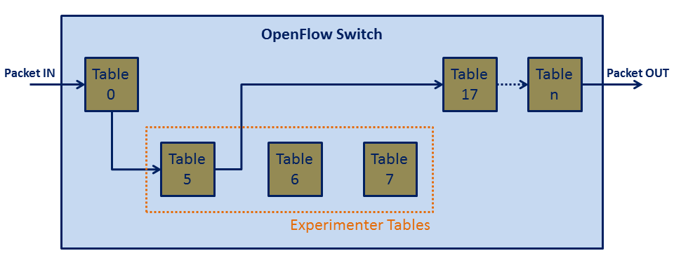

# OpenDaylight API

## Introduction
The testbeds which integrate OpenDaylight controller provide to the experimenter the access to MD-SAL Restconf API for OpenFlow Plugin. [1]

## Usage
As described in [SDN Manager documentation](sdn-manager), after successful instantiation of the resources, the experimenter receives the URI of the proxied OpenDaylight controller, a token and the list of tables assigned to him.

When the experiment starts, for every OpenFlow node, all the flows of table 0 are redirected to the first table assigned to the user and then go to table 17.

Then, the experimenter can make JSON Restconf requests to the proxied SDN controller. Every request must contain in the header the token received, and the experimenter can create/edit/delete flows only in the tables assigned to him.

The created flows can forward packets only to other experimenter owned tables or to the table 17.

As action, in the attribute **"output-node-connector"** are **allowed** only the values **"TABLE"** and **"IN_PORT"**, or a **port_id**
The values **"ALL"**, **"CONTROLLER"**, **"ANY"**, **"LOCAL"**, **"NORMAL"**, **"FLOOD"** are **not allowed**.

For further information about these values, you can read the [official Openflow documentation](https://www.opennetworking.org/images/stories/downloads/sdn-resources/onf-specifications/openflow/openflow-spec-v1.3.0.pdf)

All the requests that not satisfy the above requirements, will be rejected with an http status code = 403

## Examples
The official OpenDaylight OpenFlow Plugin documentation can be found  [here](https://wiki.opendaylight.org/view/OpenDaylight_OpenFlow_Plugin:End_to_End_Flows)

Examples for XML for various flow matches, instructions & actions can be found [here](https://wiki.opendaylight.org/view/Editing_OpenDaylight_OpenFlow_Plugin:End_to_End_Flows:Example_Flows), but remember, the SoftFIRE OpenDaylight controller accepts only JSON requests

## References
[1]: https://wiki.opendaylight.org/view/OpenDaylight_Controller:MD-SAL:Restconf OpenDaylight MD-SAL Documentation

