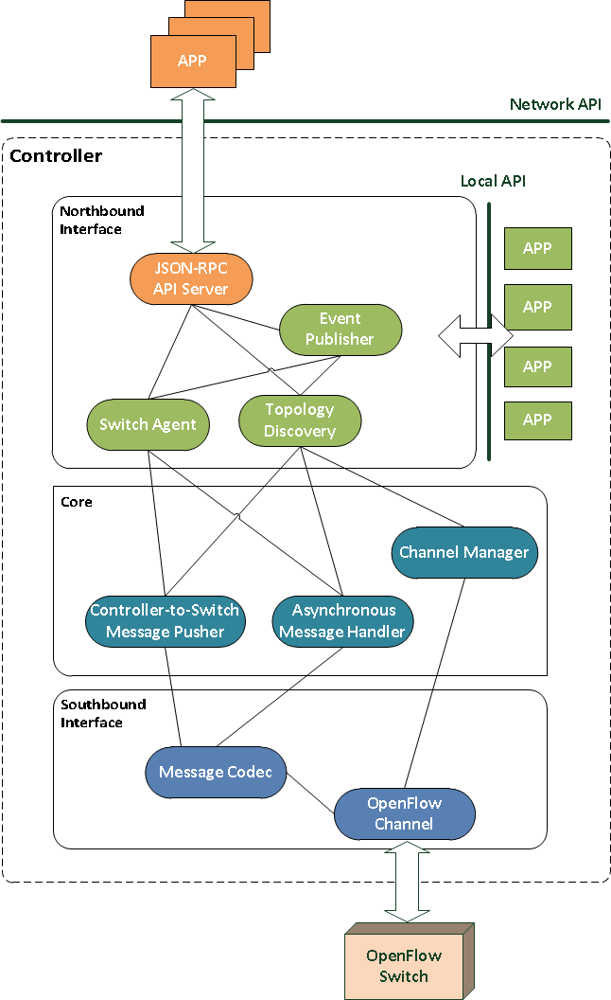

# OpenSDNCore Controller
## Introduction
The OpenFlow Controller is one of the key components in current OpenFlow architecture. Before go through this guiding page, users are recommended to read the latest [OpenFlow Specification](https://www.opennetworking.org/images/stories/downloads/sdn-resources/onf-specifications/openflow/openflow-spec-v1.4.0.pdf) and obtain a basic knowledge of !OpenFlow Technology, and how the Controller cooperates with !OpenFlow Switches.

The OpenFlow Controller is implemented as a wharf module named OFC. It is an intermediate components between the switch and higher layer applications. The following graph depicts a general view of the Controller architecture.



The !OpenFlow controller is the intermediate layer between network applications and !OpenFlow switches.
In our presented concept, the controller is based on a three-tier architecture shown in Figure \ref{fig:controller}.
The three key components of the controller are (1) the core function layer, (2) northbound interface and (3) southbound interface.

The southbound interface handles the communication with !OpenFlow switches using !OpenFlow Protocol. It consists of two components: the !OpenFlow channel and !OpenFlow message codec.The !OpenFlow channel connects each switch to the controller. The !OpenFlow message codec, as its name shows, is used for encoding/decoding each time a message needs to be sent or received.

The core function layer contains a minimized set of functions required when deploying a controller.
The controller-to-Switch Message Pusher constructs new messages and push them to the !OpenFlow channel.
For asynchronous and symmetric messages coming from switch, the corresponding message handler will be invoked,
which pre-processes the message and dispatches it to functions in northbound interface or other user defined applications outside the core space.

The northbound interface is the key enabler of network programmability. The presented open design enables network developers to develop applications by using two different kinds of API exposed by the controller.  
With the local API, applications are hosted in the same machine as the controller, and use the same programming language.
However, it is not always the case to keep the application and controller in the same environment.
Thus as an alternative solution, the network API provides the possibility of remote communication.
The controller runs an API server to handle incoming requests from other network applications.


## Documentation

 * Overview
 * Background
 * Convention
 * Compatibility
 * Controller-to-Switch Messaging
  - Message without Response
  - Message with Response
 * Events Delivery
  - OpenFlow events
  - Publish/Subscribe-like Delivery

 * [Controller-JSON-RPC-API](opensdncore-nb-api)


### 1 Overview
JSON-RPC-OF is a protocol designed for communicating with the !OpenFlow controller. It defines the JSON structures for !OpenFlow Messages and a set of methods that supported by the controller to control !OpenFlow switches. The interaction procedure is based on JSON-RPC. It uses an extended version of JSON as data format.


### 2 Background
As the leading technology of Software Defined Networking, !OpenFlow plays an important role in current network research fields. The concept of providing programmable switches makes it suitable for elastic network construction and management.

Network developers are able to control the behavior of switches by using the !OpenFlow controller, which communicates with the switches using !OpenFlow protocol. In current state of the art a variety of !OpenFlow controllers developed by different organisations and institutes are available. To ease the development of user’s own network applications, many of them are providing a northbound interface that consists of commonly used controller functions, which are exposed through a well-defined API. However, most existing solutions put emphasize on the local programming interface that supports only applications written in the same programming language, and hosted in the same machine as the controller. Such kind of deep language and platform coupling impedes fast integration of remote applications with the controller. Moreover, the diversity of API in different implementations also makes the interoperation between controller applications. Thus it becomes quite crucial to have a standard that unifies the controller API and enables easy exposure of the functions through the network.

Driven by these factors, we develop the JSON-RPC-OF protocol, which is targeting standardized communication with the !OpenFlow controller and easy extension of controller functions.

### 3 Convention

The key words "MUST", "MUST NOT", "REQUIRED", "SHALL", "SHALL NOT", "SHOULD", "SHOULD NOT", "RECOMMENDED", "MAY", and "OPTIONAL" in this document are to be interpreted as described in RFC 2119.

The data type system being used is based on JSON (RFC 4627). To ease the representation of !OpenFlow data, 5 extended types are introduced into our specification by putting restrictions on standard JSON types:

'''hex''' - a hex number given as a JSON string, where the prefix “0x” is OPTIONAL

'''enum''' - a JSON string whose value MUST be in a limit range

'''hybrid''' - a hex or an enum

'''bitmap''' - a JSON array that consists of enums

'''bytearray''' - a JSON array that consists of decimal integers, with each integer between [0, 255](i.e. a byte), or a hex byte string with the head being the first element of the array. When using hex representation, one byte MUST be represented by two hex digits.

The term "message" in this document, if not pointed-out specifically, refers to an !OpenFlow message defined in [https://www.opennetworking.org/images/stories/downloads/sdn-resources/onf-specifications/openflow/openflow-spec-v1.4.0.pdf OpenFlow specification].

The term "user" means a user of the controller, or a remote application that needs to access controller functions.

### 4 Compatibility

The JSON-RPC-OF is based on [https://www.opennetworking.org/images/stories/downloads/sdn-resources/onf-specifications/openflow/openflow-spec-v1.4.0.pdf OpenFlow specification 1.4]. As version 1.4 distinguish itself from previous version in many newly added/enhanced features, the data types and methods described in this document MAY not work with other OpenFlow version.

The JSON-RPC-OF uses JSON-RPC as the carrier protocol. All the messages exchanged SHOULD be valid JSON-RPC objects. It is not compatible with JSON-RPC 1.0. The value of “jsonrpc” field in every object MUST be exactly the string “2.0”.


### 5 Controller-to-Switch Messaging

The controller-to-switch messages are initiated by the controller and MAY or MAY not require a response from the switch. This part introduces the pattern of methods that being used to send such kind of messages to the switch.

### 5.1 Message without response

For sending messages that do not have corresponding reply, if the "id" field in a JSON-RPC request is presented, the controller SHOULD include a "msg_id" field in the response object. The "msg_id" is an identifier representing the message being sent and SHOULD be global unique to the controller. Later if the message that being sent cause an OpenFlow error in switch side, which will be reported by an asynchronous message, the controller will include the same "msg_id" in the error message. The generation of "msg_id" is outside the scope of this specification.

 Example::

```json
-->
{
    "id": 1,
    "jsonrpc": "2.0",
    "method": "set_config",
    "params": {
        "dpid": "0xaabb000102030405",
        "flags": [
            "normal",
            "reasm"
        ],
        "miss_send_len": "no_buffer"
    }
}

<--
{
    "id": 1,
    "jsonrpc": "2.0",
    "result": {
        "msg_id": "0x01020304"
    }
}
```

#### 5.2 Message with response
For sending messages that will have responses, the response object of JSON-RPC will present the response message in "reply" field.

 Example::

```json
-->
{
    "id": 1,
    "jsonrpc": "2.0",
    "method": "get_config",
    "params": {
        "dpid": "0xaabb000102030405"
    }
}

<--
{
    "id": 1,
    "jsonrpc": "2.0",
    "result": {
        "flags": [
            "normal",
            "reasm"
        ],
        "miss_send_len": "no_buffer"
    }
}
```

### 6 Events Delivery
#### 6.1 !OpenFlow Events
!OpenFlow events can be either switch-related or connection-related.

The switch-related events refer to asynchronous messages. Asynchronous messages are sent without a controller soliciting them from a switch. Switches send asynchronous messages to controllers to denote a packet arrival, switch state change or error.

The connection-related events report state changes in the connections between controller and switches. When a connection is established, interrupted or closed, a corresponding event will be generated.

##### 6.2 !Publish/Subscribe
To inform the users about incoming !OpenFlow events, a !Publish/Subscribe-like mechanism is introduced. The controller acts as a publisher of all kinds of events. And users are able to subscribe/unsubscribe to the events interested in and getting notifications when such events occur.

Before doing any subscription, the user should first register themselves to the controller. In order to be located by the controller successfully, the user/the remote application SHOULD provide a valid callback address. Later when subscribed events comes, the controller will try to publish the events by sending JSON-RPC notification to the subscriber. The format and supported protocol type of the address are outside the scope of this specification.

After successful registration, the user will get a "sub_id" from the controller, which is the identity of the subscriber. This "sub_id" SHOULD also be global unique to the controller.

The users are able to make subscription to interested events. By making or deleting subscriptions, the "sub_id" obtained during registration SHOULD be present, with which the controller can identify the subscriber properly.

When a user done with all his activities in controller side, a deregistration procedure will be performed to inform the controller about the leaving of this subscriber.

The implementation of such publish and subscribe functions are outside the scope of this specification. However, in order to show the idea more clearly, a set of Examples are presented below.

 Examples::
In the following example, the user provides essential informations for the server to send back notifications. Such information contains the connection type, IP address, listened port and name of the notify method.
 Registration::
```json
-->
{
    "json-rpc": "2.0",
    "id": 1,
    "method": "ofc.sub.register",
    "params": {
        "type": "UDP",
        "ip": "127.0.0.1",
        "port": 9999,
        "notify_method": "notify"
    }
}

<--
{
    "id": 1,
    "jsonrpc": "2.0",
    "result": {
        "sub_id": "0x12345678"
    }
}
```

 Subscription::
```json
-->
{
    "id": 1,
    "jsonrpc": "2.0",
    "method": "ofc.sub.subscribe",
    "params": {
        "sub_id": "0x12345678",
        "subscriptions": [
            {
                "dpid": "0xaabb000102030405",
                "subscriptions": [
                    "Channel_Closed",
                    "Packet_in"
                ]
            }
        ]
    }
}

<--
{
    "id": 1,
    "jsonrpc": "2.0",
    "result": "OK"
}


If later comes a packet_in message, the controller will try to connect to the subscriber and send a json-rpc notification (through tcp://127.0.0.1:9999 in this case)

<--
{
    "jsonrpc": "2.0",
    "method": "notify",
    "params": {
        "type": "Packet_In",
        "dpid": "0xaabb000102030405",
        "xid": "0x01020304",
        "buffer_id": "no_buffer",
        "reason": "no_match",
        "table_id": "0x01",
        "cookie": "0x0102030405060708",
        "ofp_match": [
            {
                "class": "ofb",
                "field": "in_port",
                "value": "0x05"
            },
            {
                "class": "ofb",
                "field": "in_phy_port",
                "value": "0x01"
            },
            {
                "class": "ofb",
                "field": "arp_op",
                "value": "0x01"
            }
        ],
        "data": "0xffffffffffff00
                 1ff344e539080600
                 0108000604000100
                 1ff344e5390a9341"
    }
}
```

 Unsubscribe::
```json
-->
{
    "id": 1,
    "jsonrpc": "2.0",
    "method": "ofc.sub.unsubscribe",
    "params": {
        "sub_id": "0x12345678",
        "subscriptions": [
            {
                "dpid": "0xaabb000102030405",
                "subscriptions": [
                    "Channel_Closed",
                    "Packet_in"
                ]
            }
        ]
    }
}

<--
{
    "id": 1,
    "jsonrpc": "2.0",
    "result": "OK"
}
```

 Deregistration::
```json
-->
{
    "id": 1,
    "jsonrpc": "2.0",
    "method": "ofc.sub.deregister",
    "params": {
        "sub_id": "0x12345678"
    }
}

<--
{
    "id": 1,
    "jsonrpc": "2.0",
    "result": "OK"
}
```

### 7 Extensions

The controller developers are able to develop their own extensions for the JSON-RPC-OF protocol by introducing new methods, only if such methods meet the requirements of standard JSON-RPC 2.0, and not violating the rules defined in this specification. By using the JSON format, more expressive data structures and APIs could be defined easily.
