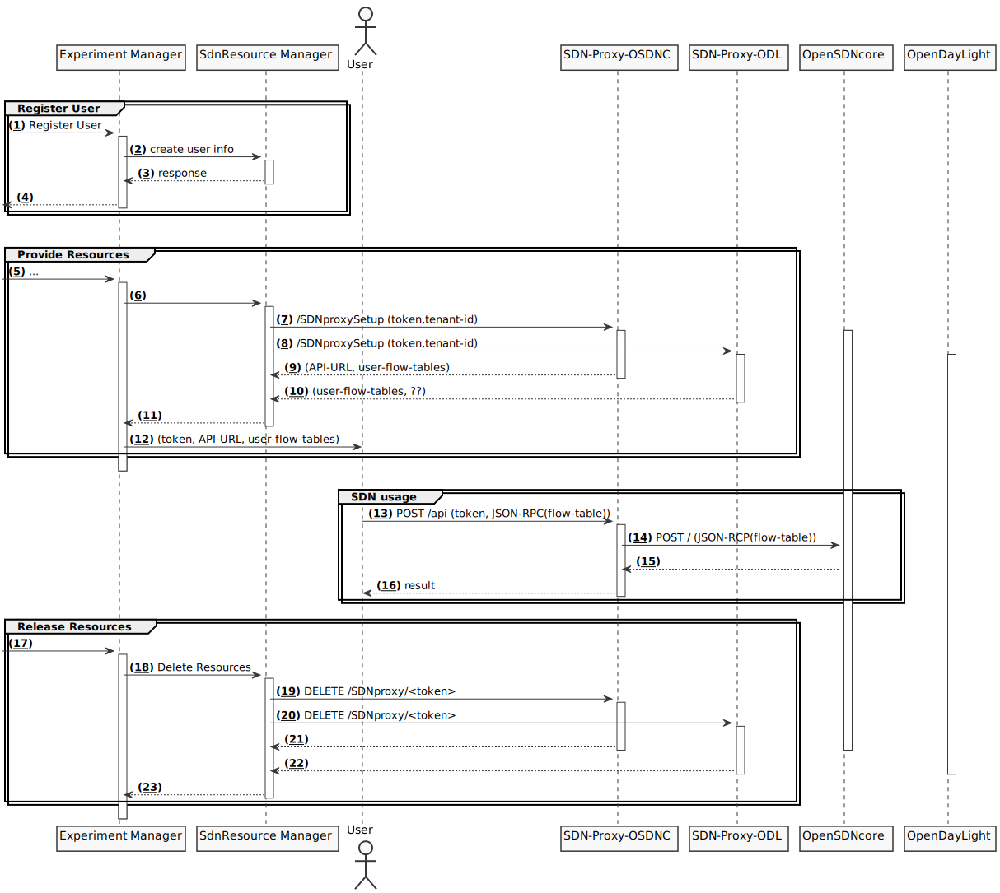

# SDN Manager

The SDN Manager is in charge of managing access to the SDN resources provided by some testbeds.

The SDN Manager keeps track of the API endpoints towards the SDN proxy services.

The SDN Manager uses the following Experiment Lifecycles:

 * List
 * Provision
 * Release

Upon list resources the SDN Manager returns a list of available SDN endpoints to the Experimenter.

To actually use an SDN resopurce in an experiment an SDNResource has to be included in the experiment descripton that matches a resource ID returned by list resources.



## SDN Resource Type

The SdnResource node type is defined as follows, as per [node types page][node_types]:

```yaml
eu.softfire.BaseResource:
  derived_from: tosca.nodes.Root
  properties:
    resource_id:
      type: string
      required: true

SdnResource:
  derived_from: eu.softfire.BaseResource
  description: Defines a SDN resource request in the SoftFIRE Middleware

```

This Resource has the following properties:

* **resource_id**: Defines the type of the SDN Resource. Depending on this ID the testbed that is used to provide the SDN resource implicit is chosen.

## Assigned Resource Data

After successful instantiation of the resource the experimenter receives an JSON object with the following information to actually use the provided SDN resource.

List of resource objects

 * **resource-id**: the ID of the allocated resource
 * **URI**: An URL that is used to interact with the actual SDN resource according to the API specification of this particular Type.
 * **flow-table-range**: List of flow table id's that can be used by the Experimenter to place its own flow-rules.
 * **token**: A security token that needs to be send with every request to the API endpoint specified by the URI property. This token is used to identify the Experiment ad to allow access the the networking resources associated with this experiment.

## Currently supported SDN endpoints

Each testbed can provide a different imlementation of SDN resources. The current version of the SoftFIRE SDN middleware provides access to two types of SDN controllers:

* The Frauhofer FOKUS testbed uses its own implementation of an SDN controller named [OpenSDNCore][opensdncore-www].
  Specification of the provided API features can be found in its [documentation pages][opensdncore]
* The Ericsson testbed provides access to [OpenDayLight][odl-www] SDN controllers.

<!--
References
-->

[opensdncore-www]:http://www.opensdncore.org/
[odl-www]:https://www.opendaylight.org/
[opensdncore]:opensdncore.md
[openvpnconfig]:openvpnconfig.md
[node_types]:etc/softfire_node_types.yaml


<!---
 Script for open external links in a new tab
-->
<script src="http://ajax.googleapis.com/ajax/libs/jquery/1.7.1/jquery.js"></script>
<script type="text/javascript" charset="utf-8">
      // Creating custom :external selector
      $.expr[':'].external = function(obj){
          return !obj.href.match(/^mailto\:/)
                  && (obj.hostname != location.hostname);
      };
      $(function(){
        $('a:external').addClass('external');
        $(".external").attr('target','_blank');
      })
</script>
