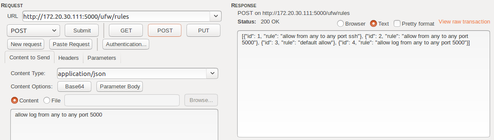

# SecurityResource tutorial firewall

This tutorial will guide you through the definition of the firewall example and to upload it.

!!! Note
    This tutorial assumes that you use a Unix system.

Create all the folders needded

```
$ mkdir firewall-softfire
$ cd firewall-softfire
$ mkdir Files
$ mkdir TOSCA-Metadata
$ mkdir Definitions
```

now we need to create the necessary files.

```
touch TOSCA-Metadata/TOSCA.meta
touch TOSCA-Metadata/Metadata.yaml
touch Definitions/experiment.yaml
```

The TOSCA-Metadata/TOSCA.meta file contains TOSCA specific configurations:

```
vim TOSCA-Metadata/TOSCA.meta
```

Here you must write something like this:

```
TOSCA-Meta-File-Version: 1.0
CSAR-Version: 1.1
Created-By: SoftFIRE
Entry-Definitions: Definitions/experiment.yaml
```

You can change the Created-By property, if you wish.

then we do the same with TOSCA-Metadata/Metadata.yaml that contains Metadata info of the experiment

```
vim TOSCA-Metadata/Metadata.yaml
```

Here you should write something like this:

```yaml
name: Experiment Name
start-date: "2017-08-10"
end-date: "2017-08-11"
```

Change start-date and end-date fields according to your experiment.
now we can write the definition of the experiment:

```sh
vim Definitions/experiment.yaml
```

Here you should write something like this:

```yaml
description: "Template for SoftFIRE yaml resource request definition"
imports:
  - softfire_node_types: "http://docs.softfire.eu/etc/softfire_node_types.yaml"
topology_template:
  node_templates:
    f:
      type: SecurityResource
      properties:
        resource_id: firewall
        want_agent: false
        lan_name: private
        testbed: fokus
        default_rule: allow
        denied_ips: [172.20.10.138]
        logging: true
```

all the fields are explained in the [Security manager page](security-manager.md)

Create the CSAR file:

```sh
zip -r firewall.csar . -x ".*" -x "*/.*"
```

Now you have to uploaded this file to the Experiment Manager GUI like the following images.
Go to [experimenter page](http://experiment.vpn.softfire.eu:5080/experimenter) and click on "Reserve Resource"


When you click on send, the Managers will validate the resources, in case you did some mistake they should be shown now. If no errors are shown, you are able to deploy your resources by clicking deploy. Please consider that it takes some seconds to deploy the resource dependening in the experiment definition.
Once deployed, it will take time until reaching the ACTIVE state of the resource. A button on the right enable the automatic refresh of the resources' values or disable it, in the second case you will need to refresh the page.
Finally the firewall resource reaches the ACTIVE state and also the floating ip are shown in the newly created resource section of the experimenter GUI. Note that the floating ip changes for every deployment.


You are now able to interact with the created VM at the address shown in *api_url*. 

You can for example see the current status of the firewall. 


Or add new rules. 



You can find the complete list of API on [this page](etc/firewall_api.md). 

If you specified *logging: true*, then you can go to *dashboard_log_link* to see some statistics about the rules that you want to write log messages. Here an example of the dashboard. 


Then remember always to delete the resources by clicking in the delete button.


<!---
 Script for open external links in a new tab
-->
<script src="http://ajax.googleapis.com/ajax/libs/jquery/1.7.1/jquery.js"></script>
<script type="text/javascript" charset="utf-8">
      // Creating custom :external selector
      $.expr[':'].external = function(obj){
          return !obj.href.match(/^mailto\:/)
                  && (obj.hostname != location.hostname);
      };
      $(function(){
        $('a:external').addClass('external');
        $(".external").attr('target','_blank');
      })
</script>
