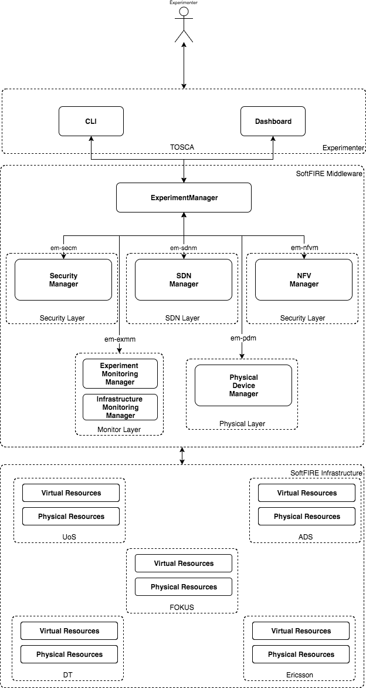

## SoftFIRE architecture

The SoftFIRE Middleware is the central software logic of the SoftFIRE platform. It exposes a ReST api that are consumed by a CLI or a Dashboard. The Experimenter can use one of these two tools for interacting with the SoftFIRE platform. The southbound interface is directed to the testbeds. Deutsche Telekom, Fraunhofer FOKUS, Ericsson, University of Surrey and Assembly Data System.

## The SoftFIRE Middleware

The central core logic of the SoftFIRE platform is the SoftFIRE Middleware. The SoftFIRE Middleware is composed by multiple managers, each of them is in charge of a specific kind of resource.

* **SDN Manager** manages SDN resources
* **Security Manager** for the Security resources
* **NFV Manager** is in charge of providing NFV functionalities to the middleware
* the **Monitoring managers** provide both experimenter and infrastructure monitoring resource access
* **Physical Device Manager** handles the access to the physical resources

The main component of the infrastructure is the **Experimenter Manager** (EM). Other managers register to the EM, so the EM is able to redirect the request coming from the Experimenter to the correct specific manager depending on the kind of resource requested. Its main features include:

* Resource discovery
* Understand the experiment definition
* Resource reservation
* Resource provisioning
* Provide Experiment Monitoring
* User Authentication
* User Authorization

The protocol in between the managers is [**gRPC**](http://www.grpc.io/). For that reason each manager can be implemented in any language that supports gRPC.

### Interactions

<!---
 Script for open external links in a new tab
-->

